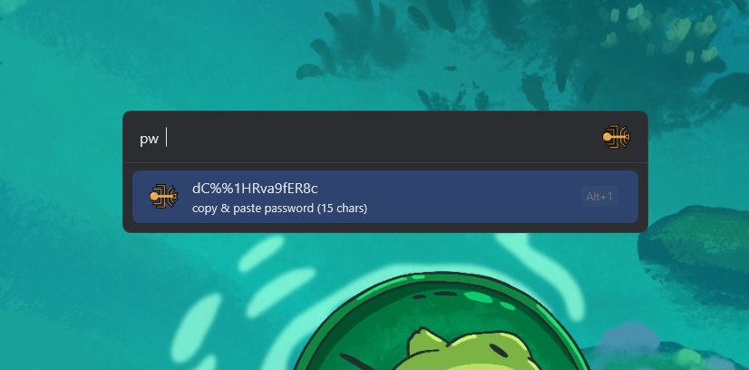
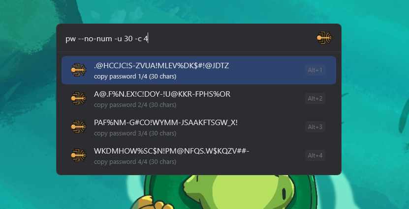
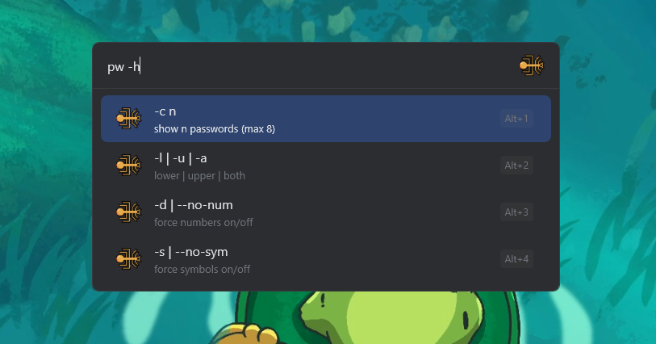

# flowgen (fork)

fork of [HOK405/Flow.Launcher.Plugin.PassGen](https://github.com/HOK405/Flow.Launcher.Plugin.PassGen)
same core plugin, minimal additions for faster shell style use (because why the hell not?)

## usage

- `pw` -> generate password using plugin defaults
- `pw 30` -> generate 30-char password

minimal argument additions:

- `pw -h` -> show quick flags
- `pw 24 -c 4` -> show 4 passwords, each 24 chars
- `pw 20 -l` -> lower only
- `pw 20 -u` -> upper only
- `pw 20 -a` -> lower + upper
- `pw 20 -d` -> force numbers on
- `pw 20 --no-num` -> force numbers off
- `pw 20 -s` -> force symbols on
- `pw 20 --no-sym` -> force symbols off

## images

**no arguments**

**with arguments**: no numbers, uppercase, length 30, 4 passwords

**general help output**

## settings

open `settings -> plugins -> password generator` & tune length mode, character sets, etc :)
